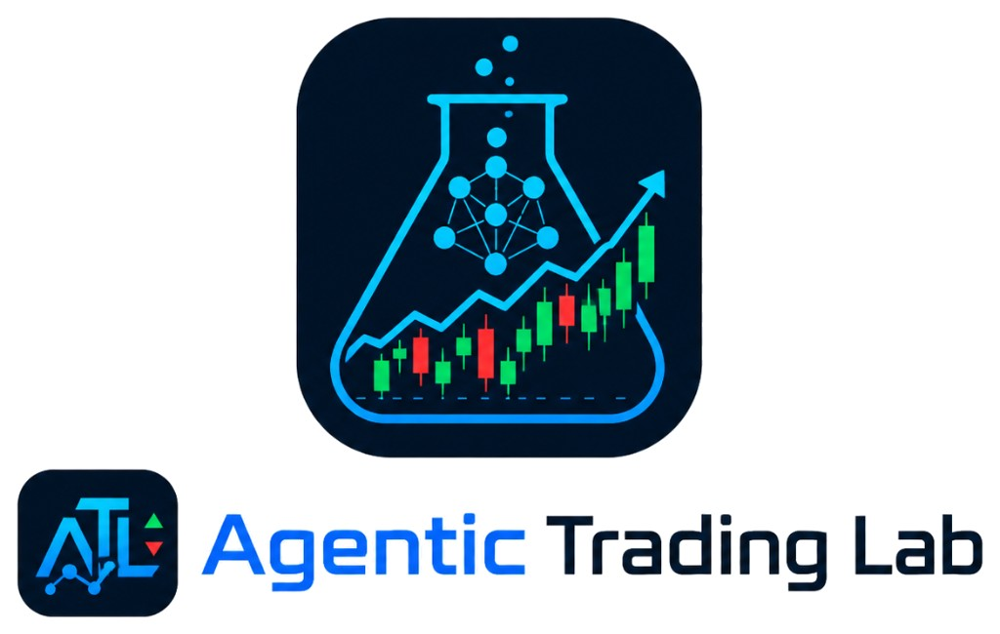

11
<div align="center">
  
</div>

# Agentic Trading Lab

**Live app:** [agentic-trading-lab.vercel.app](https://agentic-trading-lab.vercel.app/)

**Discord Community**: [https://discord.gg/9HnQ6XDG98](https://discord.gg/9HnQ6XDG98)

Trading agents powered by LLMs: backtesting and paper trading with real Alpaca market data. Compare agent strategies against buy-and-hold and index baselines, with a web dashboard for equity curves and live quotes.

## Overview

Agentic Trading Lab is an interactive research and educational platform for exploring trading systems powered by large language models. Built alongside a systematic survey of 130+ agentic trading papers, the project aims to make agentic trading research more accessible by allowing students, researchers, and developers to customize trading agents, evaluate their performance, and study how they behave in realistic market settings.

The platform is designed to bridge the gap between alpha-seeking research and deployable trading systems. Instead of only measuring whether an agent can generate profitable signals, Agentic Trading Lab helps users understand the full trading workflow, including data processing, agent decision-making, backtesting, paper trading, execution constraints, risk control, and governance.

The current system provides three main modes. The **Backtesting** mode evaluates trading agents on historical market data and compares their performance against market baselines. The **Paper Trading** mode connects agents to an Alpaca paper trading account for simulated real-time trading. The **Leaderboard** mode is designed for competition-style evaluation, where different agents or teams can be compared under standardized metrics.

Agentic Trading Lab serves as both a research tool and an educational playground for studying how LLM-based trading agents perform beyond static benchmarks and under practical market constraints.

## **Key Features**

- **Trading Agents powered by LLMs**  
It supports experimentation with language-model-driven decision-making (BUY / SELL / HOLD).
- **Educational Playground**  
Designed for students and beginners to explore trading without dealing with APIs or infrastructure.
- **Interactive Backtesting Interface**  
Users can select custom time ranges and simulate trading strategies on historical market data.
- **Performance Evaluation**  
It reports important trading metrics such as final portfolio value, cumulative return, maximum drawdown, and Sharpe ratio. These metrics help users compare strategies beyond simply looking at the equity curve.
- **Paper Trading**  
It includes a paper-trading interface where users can view simulated real-market trading performance, account summary, open positions, recent trades, and portfolio value over time.

## Project Structure

```
AgenticTrading/
├── backend/              # FastAPI app, SQLite layer, paper trading, LLM validator
├── frontend/             # Dashboard (served by backend at http://localhost:8000)
├── scripts/              # CLI backtest (backtest_hourly_agent.py, etc.)
├── config/               # Default run IDs and date range (defaults.json)
├── data/                 # SQLite backtest results (backtest.db)
├── credentials/          # Local only — not in git (see alpaca.json.example)
├── backups/              # Database backups
├── docs/                 # Sphinx docs (see docs/README.md for local preview)
├── readthedocs.yml       # Read the Docs build config
└── orchestration/        # FinAgent multi-agent framework (separate subsystem)
```

## Architecture

```
┌─────────────────────────────────────────────────────────────┐
│ Backtest Engine (scripts/backtest_hourly_agent.py)          │
│ ├─ Fetch Alpaca hourly bars                                 │
│ ├─ Run agent + baseline logic                               │
│ ├─ Write 3 runs (agent, buy-and-hold, DJIA)                 │
│ └─ Store in data/backtest.db (SQLite)                        │
└────────────────┬────────────────────────────────────────────┘
                 │
┌────────────────▼─────────────────────────────────────────────┐
│ REST API (backend/app.py)                                    │
│ ├─ GET  /health                                              │
│ ├─ GET  /runs, /runs/{id}/equity, /compare                   │
│ ├─ POST /backtest/run, GET /backtest/status                  │
│ ├─ GET  /ticker                                              │
│ ├─ GET  /paper/account, /paper/positions, …                  │
│ └─ GET  /config/defaults                                     │
│     (LLM example: backend/llm_integration_example.py only)   │
└────────────────┬────────────────────────────────────────────┘
                 │
┌────────────────▼─────────────────────────────────────────────┐
│ Web Dashboard (frontend/)                                    │
│ ├─ index.html, app.js, styles.css                            │
│ └─ images/                                                   │
└──────────────────────────────────────────────────────────────┘
```

## Quick Start

Run a backtest in the dashboard:

1. Open **[agentic-trading-lab.vercel.app](https://agentic-trading-lab.vercel.app/)** or **[http://localhost:8000/](http://localhost:8000/)** (if deployed locally) and stay on the **Backtest** tab.
2. Set the date range, assets, and model in the left sidebar.
3. Click **▶ Run Backtest**.
4. Wait for the run to finish — the UI polls `/backtest/status` and reloads the equity charts when complete.

You get interactive charts and comparison views (agent, buy-and-hold, DJIA) in the **Trading Performance** panel.

**CLI (optional)** — For headless or scripted runs only; there is little visualization in the terminal:

```bash
python3 scripts/backtest_hourly_agent.py --start 2026-03-01 --end 2026-03-31
python3 scripts/backtest_hourly_agent.py --mode buy_and_hold   # validation mode
```

Use the dashboard to inspect results after a CLI run, or call `POST /backtest/run` with the same parameters the UI sends.

## Local Deployment

### 1. Install dependencies

```bash
pip install -r requirements.txt
```

### 2. Configure Alpaca credentials

Use **either** environment variables **or** a local credentials file.

**Option A — `.env` (recommended for deploy):**

```bash
cp .env.example .env
# Edit .env:
# ALPACA_API_KEY=your_key
# ALPACA_SECRET_KEY=your_secret
# ALPACA_BASE_URL=https://paper-api.alpaca.markets
```

**Option B — local file (for backtest CLI and local API fallback):**

```bash
cp credentials/alpaca.json.example credentials/alpaca.json
# Edit credentials/alpaca.json with your paper-trading keys
```

The `credentials/` folder is not tracked in git. See `credentials/README.md`.

### 3. Start API server

```bash
python3 backend/app.py
```

### 4. Open dashboard

```
http://localhost:8000/
```

## Future Roadmap

- Leaderboard backed by real multi-agent runs (replace mock data)
- Sentiment analysis (Reddit, news APIs)
- Monte Carlo simulation baselines
- Production-ready Docker image (frontend + data included)

## Acknowledgements

This repository includes the FinAgent Orchestration Framework under `orchestration/`, originally developed by Jifeng Li et al. at Open Finance Lab as part of the work on financial agent orchestration. The orchestration framework provides multi-agent architecture, memory systems, and DAG-based planning components. See `orchestration/README.md` for details.

If you use the orchestration framework in research, please cite:

```bibtex
@inproceedings{orchestration_finagents_2025,
   title     = {Orchestration Framework for Financial Agents: From Algorithmic Trading to Agentic Trading},
   author    = {Jifeng Li and Arnav Grover and Abraham Alpuerto and Yupeng Cao and Xiao-Yang Liu},
   booktitle = {NeurIPS 2025 Workshop on Generative AI in Finance},
   year      = {2025},
}

```

Plain-text citation:

Jifeng Li, Arnav Grover, Abraham Alpuerto, Yupeng Cao, and Xiao-Yang Liu. *Orchestration Framework for Financial Agents: From Algorithmic Trading to Agentic Trading*. NeurIPS 2025 Workshop on Generative AI in Finance, 2025.

Documentation: [finagent-orchestration.readthedocs.io](https://finagent-orchestration.readthedocs.io) (Agentic Trading Lab + Orchestration Framework). Local preview: `docs/README.md`

## License

OpenMDW-1.0 — See [LICENSE](LICENSE) (Copyright Jifeng Li @ SecureFinAI Lab)

## Contributing

Pull requests and issues welcome!

---

Built with Alpaca API, FastAPI, Chart.js, and SQLite