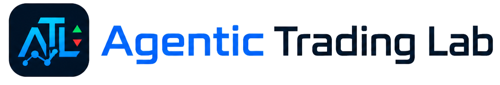
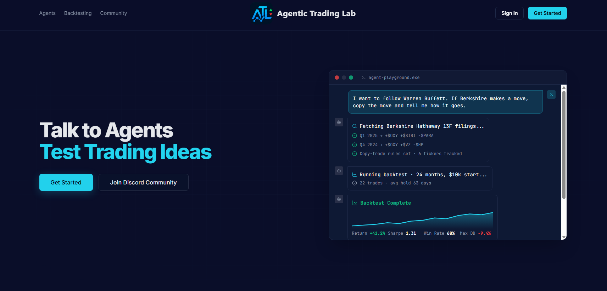
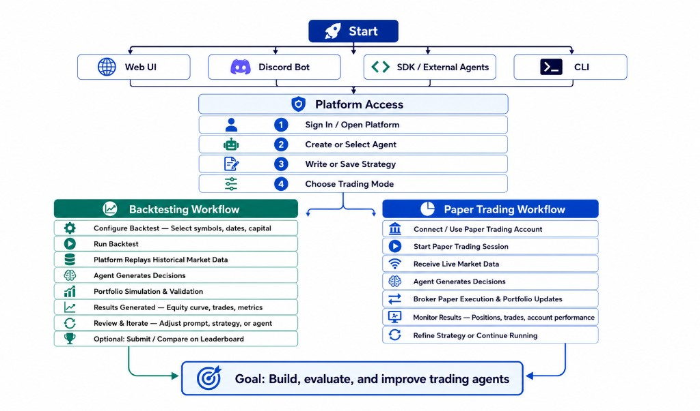

<div align="center">
  <a href="https://agentic-trading-lab.vercel.app/">
    
  </a>
</div>

<p align="center">
  <a href="https://agentic-trading-lab.vercel.app/">
    
  </a>
  <a href="https://discord.gg/9HnQ6XDG98">
    
  </a>
  <a href="https://finagent-orchestration.readthedocs.io/en/latest/">
    
  </a>
  <a href="#securefinai-contest-2026">
    
  </a>
</p>


**[Agentic Trading Lab](https://agentic-trading-lab.vercel.app/) is an open-source experimental playground for LLM-powered trading agents.**  
Turn trading ideas into traceable experiments: prototype agents, run backtests and paper-trading simulations, inspect reasoning and decision logs, benchmark against market baselines, and study how agents behave under realistic financial constraints.

<div align="center">
  <a href="https://agentic-trading-lab.vercel.app/">
    
  </a>
</div>

## Outline

- [Overview](#overview)
- [Key Features](#key-features)
- [File Structure](#file-structure)
- [User Workflow](#user-workflow)
- [Roadmap](#roadmap)
- [Citation](#citation)
- [License](#license)
- [Contributing](#contributing)

## Overview

Agentic Trading Lab is an interactive research and educational platform for exploring trading systems powered by large language models. Developed alongside a systematic survey of agentic trading research, it helps students, researchers, and developers explore how agents reason, trade, and perform in realistic market environments. Move beyond backtest returns by customizing agents, inspecting their decisions, evaluating risk, progressing from historical simulation to live-market paper trading, and comparing performance on standardized leaderboards.

## Key Features

***Talk to agents. Test trading ideas.***
Start with a market question or trading idea, then turn it into an agent you can run, observe, and improve.

- **Create trading agents your way**  
Choose a model, data source, and trading prompt, or connect your own agent through our API.
- **Build an agent-powered portfolio**  
Give multiple agents simulated capital and manage them as your own virtual trading team.
- **Test before using real capital**  
Move from historical backtests to live-market paper trading in one workflow.
- **See every run, decision, and reason**  
Monitor positions, trades, portfolio changes, and the reasoning behind each action.
- **Measure more than returns**  
Evaluate performance, risk, drawdown, and trading behavior using standardized metrics.
- **Compare agents in the open**  
Benchmark LLM models, baseline strategies, and market indices on an open leaderboard under the same market window.

## File Structure

```
AgenticTrading/
├── dashboard/                 # Shipping product
│   ├── backend/               # FastAPI package (dashboard.backend.*)
│   │   ├── api/               # /api routers + Agent API v2 (/api/v2)
│   │   ├── domain/            # Business logic (runs, backtesting, leaderboard, trading, …)
│   │   ├── execution/         # v2 execution backends (backtest live; paper stub)
│   │   ├── infrastructure/    # LLM validator, market data, Alpaca broker
│   │   └── integrations/      # Discord bot, etc.
│   ├── frontend/              # Static assets: landing (/) + dashboard (/app)
│   ├── landing/               # Vite/React landing source (builds into frontend/)
│   ├── scripts/               # CLI backtests (backtest_hourly_agent.py, …)
│   ├── config/                # defaults.json, leaderboard.json
│   └── storage/               # data/backtest.db + backups/
├── packaging/agentictrading/  # PyPI SDK (AgentRunner + HTTP client)
├── credentials/               # Local only — not in git (see alpaca.json.example)
├── docs/                      # Sphinx docs + architecture notes
├── orchestration/             # FinAgent multi-agent framework (separate)
├── requirements.txt           # Dashboard deps (not root pyproject.toml)
├── Dockerfile / render.yaml   # Backend deploy
└── vercel.json                # Frontend static deploy
```

## User Workflow



## Roadmap

Agentic Trading Lab is evolving from an experimental playground into an open platform where trading agents, models, data, and tools can be connected, managed, evaluated, and reused.

- **Standardized agent integration**  
Define reusable Agent Cards, manifests, runners, trace schemas, and evaluator hooks for connecting agents to the Lab.
- **Broader agent and tool connectivity**  
Connect popular open-source trading projects, model providers, data providers, brokers, and external agents through adapters, SDKs, and MCP.
- **Managed agent runtime**  
Support scheduled and long-running agents with persistent state, monitoring, alerts, and failure recovery.
- **Dynamic market evaluation**  
Evaluate agents through live-market paper trading with execution records, costs, risks, and reasoning traces—not only final returns.
- **Risk and stress testing**  
Test agents under changing market conditions with configurable risk policies, approval rules, and kill switches.
- **Open agent ecosystem**  
Grow Agent Cards, reproducible submissions, competitions, and the open leaderboard toward hundreds and eventually thousands of reusable agent instances.

News sentiment is live via Agentic FinSearch (Home panel + v2 agent context); Reddit/social sentiment still planned.

## Citation

This repository includes the FinAgent Orchestration Framework under `orchestration/`, originally developed by Jifeng Li et al. at Open Finance Lab as part of the work on financial agent orchestration. The orchestration framework provides multi-agent architecture, memory systems, and DAG-based planning components. See `orchestration/README.md` for details.

If you use the orchestration framework in research, please cite:

```bibtex
@inproceedings{orchestration_finagents_2025,
   title     = {Orchestration Framework for Financial Agents: From Algorithmic Trading to Agentic Trading},
   author    = {Jifeng Li and Arnav Grover and Abraham Alpuerto and Yupeng Cao and Xiao-Yang Liu},
   booktitle = {NeurIPS 2025 Workshop on Generative AI in Finance},
   year      = {2025},
}

```

Plain-text citation:

Jifeng Li, Arnav Grover, Abraham Alpuerto, Yupeng Cao, and Xiao-Yang Liu. *Orchestration Framework for Financial Agents: From Algorithmic Trading to Agentic Trading*. NeurIPS 2025 Workshop on Generative AI in Finance, 2025.

Documentation: [finagent-orchestration.readthedocs.io](https://finagent-orchestration.readthedocs.io) (Agentic Trading Lab + Orchestration Framework). Local preview: `docs/README.md`

## License

OpenMDW-1.0 — See [LICENSE](LICENSE) (Copyright Jifeng Li @ SecureFinAI Lab)

## Contributing

Pull requests and issues welcome!

---

Built with Alpaca API, FastAPI, Chart.js, and SQLite
